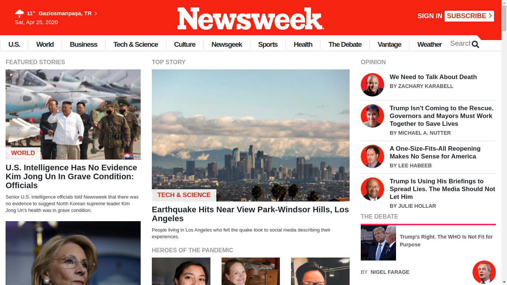

# newsweek-clone

This is a Microverse project focusing on responsive design by using Bootstrap. It was developed as a requirement for Microverse HTML and CSS course.

Additional description about the project and its features.
In this Microverse project, we made use classes provided by Bootstrap to make a clone of [ NewsWeek](https://www.newsweek.com/) page . 

## Built With

- Html
- CSS
- JavaScript    

## Live Demo

[Live Demo Link](https://rawcdn.githack.com/ozovalihasan/newsweek-clone/65f88d1b32927ce3797f44b68adeb4230524d311/index.html)

## Getting Started

**Click on the link above in order to see the Live Demo of the front end project.**

To get a local copy up and running follow these simple example steps.

### Prerequisites

- Web Browser
- Text Editor

### Setup

- Download repository files

## Authors

👤 **Hasan Özovalı**

- Github: [@ozovalihasan](https://github.com/ozovalihasan)
- Twitter: [@ozovalihasan](https://twitter.com/ozovalihasan)
- Linkedin: [Hasan Özovalı](https://www.linkedin.com/in/hasan-ozovali/)
- Mail: [ozovalihasan@gmail.com](ozovalihasan@gmail.com)

## 🤝 Contributing

Contributions, issues and feature requests are welcome!

Feel free to check the [issues page](issues/).

## Show your support

Give a ⭐️ if you like this project!

## Acknowledgments

- Hat tip to anyone whose code was used
- Inspiration
- etc

## 📝 License

This project is [MIT](lic.url) licensed.
